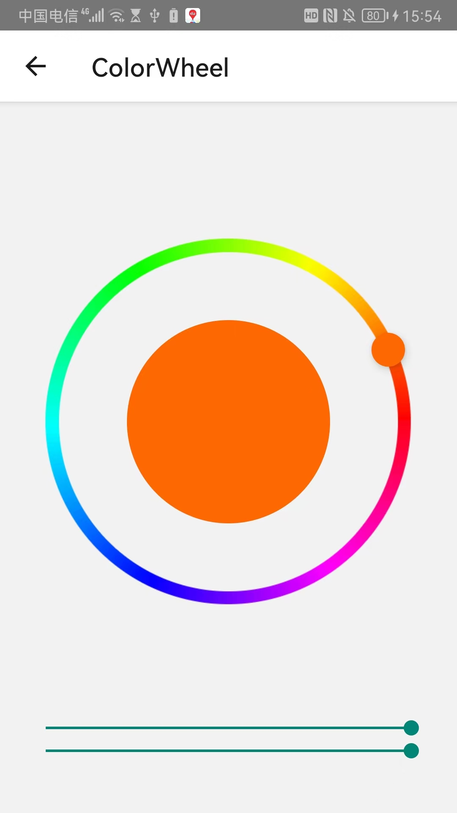
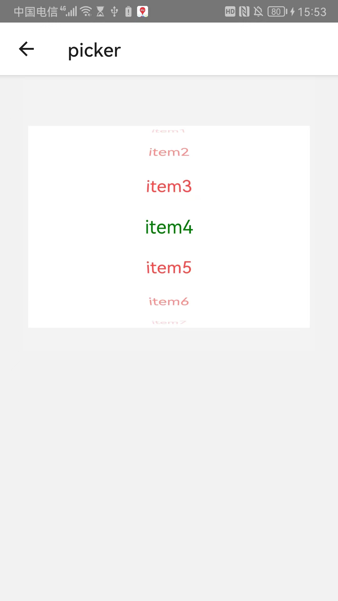
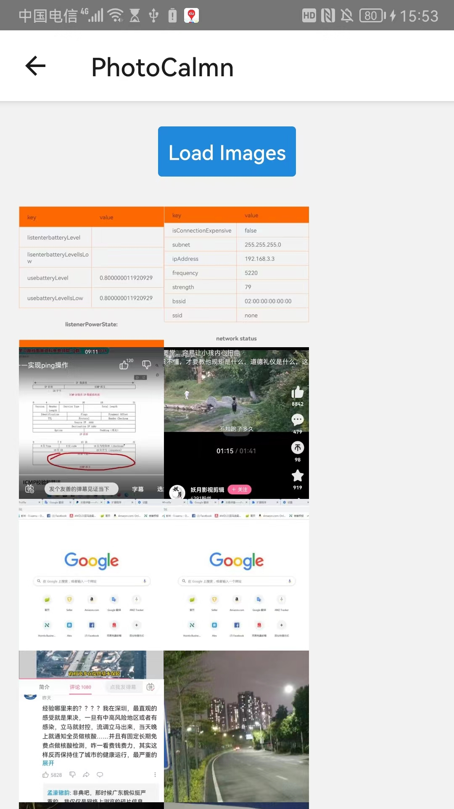
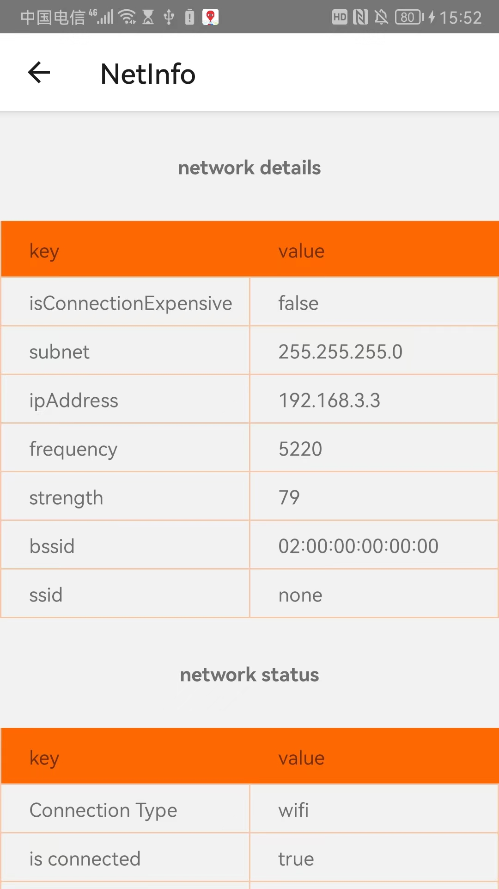

# jacky 专用的 playground,

## 项目介绍

react-native 第三方库的使用方法和效果展示，提供三方库的快速集成训练场

## 1.部分功能展示

<!-- 


 -->


[视频展示](https://www.zhihu.com/zvideo/1687141395255635968)

##2. 主要采用的技术栈 react-native0.62.2

##3. 使用的第三方库请参考 package.json 的依赖

##4. 环境

```
System:
    OS: macOS 11.6
    CPU: (12) x64 Intel(R) Core(TM) i5-10500 CPU @ 3.10GHz
    Memory: 8.62 GB / 32.00 GB
    Shell: 5.8 - /bin/zsh
  Binaries:
    Node: 14.16.0 - /usr/local/bin/node
    Yarn: 1.22.19 - /usr/local/bin/yarn
    npm: 6.14.11 - /usr/local/bin/npm
    Watchman: 2023.08.14.00 - /usr/local/bin/watchman
  Managers:
    CocoaPods: 1.12.1 - /Users/jacky/.rbenv/shims/pod
  SDKs:
    iOS SDK:
      Platforms: iOS 14.5, DriverKit 20.4, macOS 11.3, tvOS 14.5, watchOS 7.4
    Android SDK:
      API Levels: 23, 28, 29, 30, 31, 33
      Build Tools: 27.0.3, 28.0.3, 29.0.2, 30.0.2, 30.0.3, 31.0.0, 33.0.0, 33.0.1
      System Images: android-29 | Intel x86 Atom_64, android-29 | Google Play Intel x86 Atom, android-30 | Google APIs Intel x86 Atom, android-30 | Google Play Intel x86 Atom, android-33 | Google APIs Intel x86_64 Atom
      Android NDK: 22.1.7171670
  IDEs:
    Android Studio: 2022.3 AI-223.8836.35.2231.10671973
    Xcode: 12.5.1/12E507 - /usr/bin/xcodebuild
  Languages:
    Java: 1.8.0_292 - /Users/jacky/.jenv/shims/javac
    Python: 2.7.16 - /usr/bin/python
  npmPackages:
    @react-native-community/cli: Not Found
    react: 16.11.0 => 16.11.0
    react-native: 0.62.2 => 0.62.2
    react-native-macos: Not Found
  npmGlobalPackages:
    *react-native*: Not Found
```
